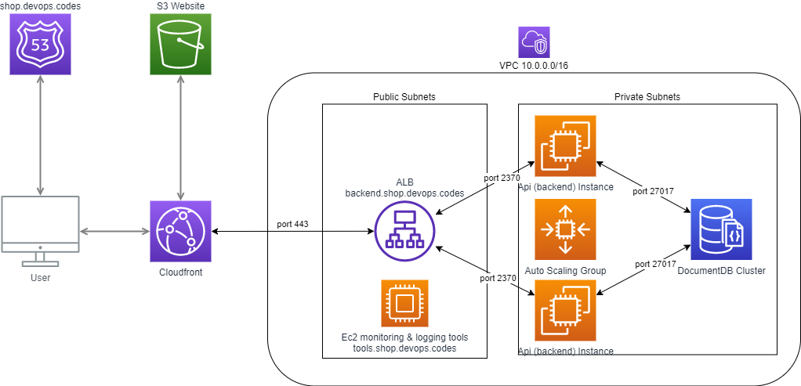

# Bgshop
To see the functionality of the app please watch this YT video: https://youtu.be/Wk3vtXJgr-I

## Architecture

## Installation

### Infra Requirements

- Terraform v0.13.5
- provider.aws v3.29.0

### Prerequisites

- Fill all the variables both in 'staging' & 'network' in 'infrastructure' directory. Make sure that you put the same values for Region, S3 Bucket and DynamoDB Table in 'init_remote_backend.sh' & 'main.tf'. The backend for remote state for 'staging' in data.tf has to match with main.tf in 'network' directory.

- Create the VPC using module in 'network' directory. At this moment all the CIDR's are set up as default. If you plan to create VPC's in another Region please mind that in case of VPC Peering CIDR's can't overlap. It is needed to use separate 'terraform init' & apply in 'network' dir before you apply 'staging' environment.

- You need a Route53 existing domain and put the value of it into variable 'domain'

### Frontend (client)

JS + React 

### Backend (api)

nodeJS (:2370)

### Database

mongoDB (:27017)

### Tools

There is separate docker-compose.yml file in 'tools' directory which is deploying all the tools on separate Ec2 Instance which has open specific ports to public and be accessed at tools.yourdomain.com after deployment.

metrics: Prometheus (:9090)
logs: Graylog (:9000)
dashboards: Grafana (:3000)

